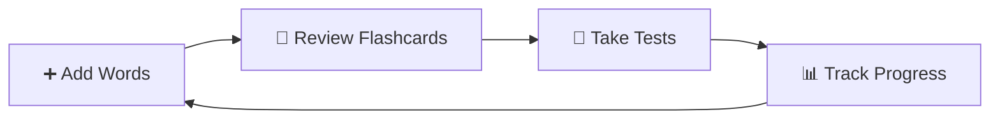

<](https://dotnet.microsoft.com/)
[](https://docs.microsoft.com/aspnet/core/)
[](https://docs.microsoft.com/ef/core/)
[](https://sqlite.org/)
[](LICENSE)

<br/>

<p align="center">
  
</p>

<br/>

<p align="center">
  <strong>🌍 Learn vocabulary in any language using scientifically-proven techniques</strong>
</p>

<br/>

[🚀 Get Started](#-quick-start) •
[✨ Features](#-features) •
[📖 Documentation](#-usage-guide) •
[🤝 Contributing](#-contributing)

---

</div>

<br/>

## 🎯 What is MyDictionary?

**MyDictionary** is a powerful vocabulary learning application that combines modern web technologies with proven learning science. Using the **Spaced Repetition System (SRS)**, AI-powered translations, and interactive learning modes, it helps you master vocabulary efficiently and retain it long-term.

<br/>

<div align="center">

| 🧠 **Smart Learning** | 🎴 **Interactive Practice** | 📊 **Track Progress** |
|:---:|:---:|:---:|
| SRS algorithm adapts to your memory | Flashcards, quizzes & matching games | Detailed statistics & insights |

</div>

<br/>

---

## ✨ Features

<table>
<tr>
<td width="50%">

### 📖 Vocabulary Management
- ➕ Add words with translations & examples
- 🏷️ Categorize by **Part of Speech**
- 🎚️ Set difficulty levels (Easy/Medium/Hard)
- ⭐ Mark favorites for quick access
- 🤖 AI-generated example sentences
- 📝 Personal notes & context

</td>
<td width="50%">

### 🧠 Spaced Repetition System
- 🔬 Scientifically-proven algorithm
- 📅 Optimized review scheduling
- 📈 Adaptive easiness factor
- 🎯 Never forget learned words
- ⏰ Smart interval calculations
- 🔄 Continuous improvement tracking

</td>
</tr>
<tr>
<td width="50%">

### 🎴 Flashcards & Practice
- 🔀 Random practice mode
- 📚 SRS-based review sessions
- 🔊 Text-to-Speech pronunciation
- ✅ Track correct/incorrect answers
- 🎯 Daily practice goals
- 📊 Session statistics

</td>
<td width="50%">

### 📝 Tests & Quizzes
- 🔢 Multiple choice questions
- 🔗 Matching exercises
- ⚙️ Customizable test length
- ⏱️ Time tracking
- 📈 Performance history
- 🏆 Achievement tracking

</td>
</tr>
<tr>
<td width="50%">

### 🏆 Daily Challenges
- 🎯 Complete daily goals
- 💎 Earn XP rewards
- 🔥 Maintain learning streaks
- 🏅 Unlock achievements
- 📅 Daily task variety
- 🎮 Gamified experience

</td>
<td width="50%">

### 📤 Import & Export
- 📄 **PDF** - Beautiful formatted lists
- 📊 **Excel** - Detailed spreadsheets
- 📁 **CSV** - Universal format
- ⬆️ Bulk import support
- 🔄 Data backup & restore
- 📱 Cross-platform sharing

</td>
</tr>
</table>

<br/>

---

## 🏗️ Architecture

<div align="center">

```
╔═══════════════════════════════════════════════════════════════════╗
║                        🌐 MyDictionary.Web                        ║
║                    ASP.NET Core MVC Application                   ║
╠═══════════════════════════════════════════════════════════════════╣
║  📂 Controllers    │  📄 Views        │  🎨 wwwroot              ║
║  • Words           │  • Razor Pages   │  • CSS/JS               ║
║  • Flashcards      │  • Layouts       │  • Static Assets        ║
║  • Tests           │  • Partials      │                         ║
║  • DailyChallenges │                  │                         ║
╚════════════════════╪══════════════════╪═════════════════════════╝
                     │                  │
         ╔═══════════╧══════════════════╧═══════════════╗
         ║       ⚙️ MyDictionary.Infrastructure         ║
         ║           Data Access & Services             ║
         ╠══════════════════════════════════════════════╣
         ║  📦 Repositories  │  🔧 Services             ║
         ║  • WordRepository │  • AIService             ║
         ║  • UserRepository │  • TranslationService    ║
         ║  • TestRepository │  • PdfGeneratorService   ║
         ║                   │  • ExcelExportService    ║
         ║                   │  • TextToSpeechService   ║
         ╚═════════════════════════════════════════════╝
                             │
              ╔══════════════╧══════════════╗
              ║    📚 MyDictionary.Core     ║
              ║   Domain Entities & Logic   ║
              ╠═════════════════════════════╣
              ║  🗃️ Entities    │ 📋 Interfaces
              ║  • Word        │ • IWordRepository
              ║  • User        │ • IUserRepository
              ║  • TestResult  │ • IAIService
              ║  • UserSettings│ • ITranslationService
              ║  • DailyChallenge
              ╚═════════════════════════════╝
```

</div>

<br/>

---

## 🛠️ Tech Stack

<div align="center">

| Category | Technology | Version |
|:--------:|:----------:|:-------:|
| 🖥️ **Framework** | ASP.NET Core MVC | 9.0 |
| 💾 **Database** | SQLite + EF Core | 9.0 |
| 📄 **PDF Export** | QuestPDF | 2025.7 |
| 📊 **Excel Export** | EPPlus | 7.5 |
| 🎨 **Frontend** | Razor + JavaScript | - |
| 🔐 **Auth** | Session-based | - |

</div>

<br/>

---

## 🚀 Quick Start

### Prerequisites

<table>
<tr>
<td>

```
✅ .NET 9.0 SDK
✅ Visual Studio 2022 / VS Code / Rider
✅ Git (optional)
```

</td>
</tr>
</table>

### Installation Steps

<details>
<summary><b>📥 Step 1: Clone the Repository</b></summary>

```bash
git clone https://github.com/yourusername/MyDictionary.git
cd MyDictionary
```

</details>

<details>
<summary><b>📦 Step 2: Restore Dependencies</b></summary>

```bash
dotnet restore
```

</details>

<details>
<summary><b>🗄️ Step 3: Setup Database</b></summary>

```bash
cd src/MyDictionary.Web
dotnet ef database update
```

</details>

<details>
<summary><b>🚀 Step 4: Run the Application</b></summary>

```bash
dotnet run --project src/MyDictionary.Web
```

</details>

<details>
<summary><b>🌐 Step 5: Open in Browser</b></summary>

```
https://localhost:5001
```

</details>

<br/>

<div align="center">

### 🎉 That's it! You're ready to start learning!

</div>

<br/>

---

## � Usage Guide

<div align="center">

### 🔄 Learning Workflow



</div>

<br/>

### 📝 Adding New Words

1. Navigate to **Words** → **Add New**
2. Enter the word and its translation
3. Select the part of speech (Noun, Verb, Adjective, etc.)
4. Choose difficulty level
5. Add example sentences (or let AI generate them! 🤖)
6. Click **Save**

<br/>

### 🎴 Flashcard Study Session

| Mode | Description |
|:----:|:------------|
| 📚 **Review Due** | Study words scheduled by the SRS algorithm |
| 🔀 **Practice Mode** | Random selection of 20 words for quick practice |

<br/>

### 📤 CSV Import Format

```csv
Word,Translation,PartOfSpeech,Difficulty,LanguageFrom,LanguageTo
hello,مرحبا,Noun,Easy,en,ar
book,كتاب,Noun,Easy,en,ar
write,يكتب,Verb,Medium,en,ar
beautiful,جميل,Adjective,Easy,en,ar
```

<br/>

---

## 📁 Project Structure

```
MyDictionary/
│
├── 📄 MyDictionary.sln              # Solution file
├── 📄 README.md                     # This file
│
├── 📂 src/
│   ├── 📂 MyDictionary.Core/        # 🧠 Domain logic
│   │   ├── 📂 Entities/             # Data models
│   │   ├── 📂 Interfaces/           # Contracts
│   │   └── 📂 Services/             # SRS algorithm
│   │
│   ├── 📂 MyDictionary.Infrastructure/  # ⚙️ Data layer
│   │   ├── 📂 Data/                 # EF DbContext
│   │   ├── 📂 Migrations/           # DB migrations
│   │   ├── 📂 Repositories/         # Data access
│   │   └── 📂 Services/             # External services
│   │
│   ├── 📂 MyDictionary.Web/         # 🌐 Web application
│   │   ├── 📂 Controllers/          # MVC controllers
│   │   ├── 📂 Views/                # Razor views
│   │   ├── 📂 Filters/              # Auth filters
│   │   └── 📂 wwwroot/              # Static files
│   │
│   └── 📂 MyDictionary.Mobile/      # 📱 Mobile app
│
└── 📂 .github/                      # CI/CD workflows
```

<br/>

---

## ⚙️ Configuration

### 📋 appsettings.json

```json
{
  "ConnectionStrings": {
    "DefaultConnection": "Data Source=mydictionary.db"
  },
  "UserSettings": {
    "DefaultLanguageFrom": "en",
    "DefaultLanguageTo": "ar"
  },
  "Features": {
    "EnableAI": true,
    "EnableTTS": true
  }
}
```

<br/>

---

## 🗺️ Roadmap

<div align="center">

| Status | Feature |
|:------:|:--------|
| ✅ | Core vocabulary management |
| ✅ | Spaced Repetition System |
| ✅ | Flashcards & Tests |
| ✅ | PDF/Excel/CSV Export |
| ✅ | AI-powered examples |
| 🔄 | Mobile app support |
| 📋 | Cloud sync |
| 📋 | Social features |
| 📋 | Gamification v2 |

</div>

<br/>

---

## 🤝 Contributing

<div align="center">

**Contributions are warmly welcomed!** 💖

</div>

<br/>

```bash
# 1. Fork the repository

# 2. Create your feature branch
git checkout -b feature/AmazingFeature

# 3. Commit your changes
git commit -m '✨ Add some AmazingFeature'

# 4. Push to the branch
git push origin feature/AmazingFeature

# 5. Open a Pull Request
```

<br/>

### 💡 Contribution Ideas

- 🐛 Bug fixes
- ✨ New features
- 📚 Documentation improvements
- 🌍 Translations
- 🎨 UI/UX enhancements

<br/>

---

## 📄 License

<div align="center">

This project is licensed under the **MIT License**

See [LICENSE](LICENSE) for more information

</div>

<br/>

---

## 🙏 Acknowledgments

<div align="center">

| Library | Purpose |
|:-------:|:--------|
| 📄 **QuestPDF** | Beautiful PDF generation |
| 📊 **EPPlus** | Excel file handling |
| 💾 **EF Core** | Database operations |
| 🎨 **ASP.NET Core** | Web framework |

</div>

<br/>

---

<div align="center">

### 🌟 Star this repo if you find it helpful!

<br/>

**Built with ❤️ for language learners worldwide**

<br/>

<p>
  <a href="#-mydictionary">⬆️ Back to Top</a>
</p>

---

<sub>© 2025 MyDictionary. All Rights Reserved.</sub>

</div>
]]>
